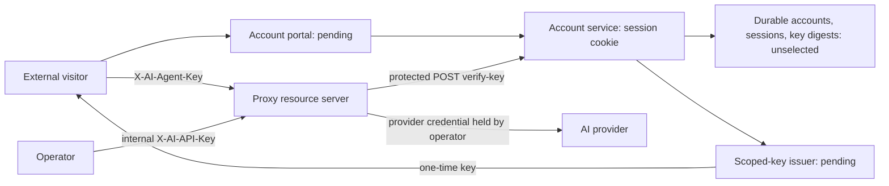

# External auth-service contract: scoped-key release

Status: local boundary contract and consumer fixtures; issuer selection blocked.
Beads: bd-bns6. Inspected 2026-09-24. This is Issue 1 of the sixteen-item caller-auth release.

## Decision record

| Decision                                  | Evidence and disposition                                                                                                                                                                                                                                                                               |
| ----------------------------------------- | ------------------------------------------------------------------------------------------------------------------------------------------------------------------------------------------------------------------------------------------------------------------------------------------------------ |
| Proxy                                     | Actual source: C:/GitHub/ai-powered, package repository mytech-today-now/ai-powered. Its operator holds the internal service secret and server provider credentials.                                                                                                                                   |
| Account-service owner                     | Unconfirmed. No accountable owner is established by inspected project evidence.                                                                                                                                                                                                                        |
| Issuer repository/deployable location     | Unconfirmed. No register, verify-email, or key-management implementation was found under src/ or integrations/. A limited read-only search of the neighboring FilmBuff apps/packages found no matching verifier reference. No deployment was inspected; this does not establish that no issuer exists. |
| Durable database/migrations               | Unselected. package.json does not select an account database or migration tool. Optional Redis supports SDK idempotency, not an established identity database.                                                                                                                                         |
| Issuer start/test/migrate/deploy commands | Unavailable until the actual service is identified. Do not invent a service directory or commands.                                                                                                                                                                                                     |
| First release                             | Scoped API keys plus real account sessions. Preserve existing RS256 JWT consumption; defer new OAuth/JWT issuance.                                                                                                                                                                                     |
| Agent policy                              | Proposed contract choice: one immutable server-assigned agent per account. No multi-agent product requirement was found. Additional keys and rotations retain that identity.                                                                                                                           |
| Release gate                              | Confirm owner, actual source/deployable location, database, executable commands, and routing before issuer-dependent work or AC-01-01 completion.                                                                                                                                                      |

The null decision fields in tests/fixtures/auth-service/contract.json intentionally fail the
selected-deployment validator. This is a fixture guard, not a runtime readiness endpoint.
The project owner has been asked for the missing decision. No production credential was
read, printed, or changed. No account issuer or durable store is implemented by this item.

## Actual consumers and intended flow

| Extension point                                       | Inspected behavior                                                                                                                                                                         |
| ----------------------------------------------------- | ------------------------------------------------------------------------------------------------------------------------------------------------------------------------------------------ |
| src/ai-powered/auth.ts                                | SDK priority: explicit JWT, explicit agent key, internal environment fallback. RS256 verification with 30-second tolerance; external POST verify-key and 60-second success cache.          |
| src/ai-powered/server/auth.ts                         | Explicit HTTP caller required; ambiguous credential classes denied; generic 401/403; exact scope enforcement. Only verified service principal is unrestricted.                             |
| src/ai-powered/server/index.ts                        | Auth precedes body parsing and provider routes. auth.required=true disables the legacy test bypass. Health/static shell stay public.                                                       |
| src/ai-powered/env.ts                                 | First-use validation. This item rejects URL userinfo/query/fragment and normalizes trailing slashes once for every consumer.                                                               |
| src/ai-powered/payments.ts                            | Existing /api/payments/x402 uses the same base. Preserve the billing request contract.                                                                                                     |
| src/ai-powered/mcp-server.ts                          | Existing /api/account/credits uses the same base and legacy X-Agent-Api-Key header. That is not a new proxy auth header.                                                                   |
| integrations/web-example/info.js, settings.js, app.js | Settings / Configuration stores caller material separately from provider credentials and supplies the web client. Operator credential selection still needs visitor adaptation in item 11. |
| src/ai-powered/web/fetch-client.ts                    | Caller headers are separate from X-AI-Provider-Credentials. Provider material never authenticates callers.                                                                                 |
| OpenSpec                                              | filmbuff-ai-powered/specs/caller-identity describes consumers, not an account issuer. Runtime authority is package.json: Node 20+, TypeScript ESM, Express 5, Zod, Pino, Vitest, Vite 8.   |

Portal, session, database, and issuance nodes below are required architecture, not observed
deployed behavior. Proxy/provider edges exist in source.



Account sessions authorize management; agent keys authorize resources; provider secrets authorize
upstream calls. Neither issuer nor portal distributes AIPOWERED_API_KEY. Provider calls remain in
the resource server/provider adapters. A developer-supplied provider key still proves no caller identity.

## Trusted base and compatibility

AIPOWERED_AUTH_ENDPOINT=https://auth.example.test/platform is an illustrative operator-owned
HTTPS service base, never a browser/request setting. A suffix /platform/ or /platform/// becomes
/platform/api/auth/verify-key. A root base becomes /api/auth/verify-key. Preserve deployment
prefixes; do not add /api to the configured base. Reject userinfo, queries, and fragments.

The operator must provision DNS/TLS, trusted service ingress, allowed portal origins, and gateway
routing. Funding /api/payments/x402 and balance /api/account/credits must remain reachable on
the existing base, or require a separately reviewed migration. Pointing the base at a new
auth-only service without those routes would break consumers.

AIPOWERED_JWT_PUBLIC_KEY=<RS256 public PEM> remains verification-only configuration when JWTs
are used. AIPOWERED_API_KEY=<operator-managed internal secret> retains its role. Never replace
that variable with a visitor key. SDK resolution order stays JWT, agent key, internal fallback;
a failed explicit credential never falls through. HTTP requests always require an explicit caller
credential. Missing/invalid issuer configuration denies an explicit agent key even with an internal
SDK fallback available.

The verifier proves agent-key possession over the protected server-to-service path, without
changing POST /api/auth/verify-key JSON or requiring a new mandatory shared header. Deployment
must restrict browser access and bound machine requests; CORS is not authentication. Redirect
refusal, bounded response reads/timeouts, strict issuer response validation, and distributed cache
coherence belong to items 7, 8, and 12 and are not established by current fetch/cache code.

## Ownership, scopes, and disclosure

Account ID is the session-derived portal owner. Agent ID is immutable, server-assigned,
non-secret, and unique across accounts. Key ID identifies one credential version. Proposed new
issuer identifiers use opaque acc_, agt_, and key_ prefixes; reserve service/test-bypass identities.
A label never determines identity. Rotation changes key ID and retains agent ID. Existing JWT
consumer identity behavior remains compatible. Item 7 must reject absent/malformed issuer agent
IDs; the current adapter can normalize them to an unknown principal, so this remains a release gate.

Exact scopes: read, generate, files:read, files:write. Issuance accepts 1-4 unique exact strings,
no default grants, wildcard, or service scope. Missing, empty, mixed, or unknown agent claims
grant no resource permission. Preserve 403 AUTH_INSUFFICIENT_SCOPE and reissue old unscoped
credentials rather than broadening access. Only the explicitly verified service principal is unrestricted.

Issuer keys need at least 256 bits of cryptographic randomness. Store only a one-way verifier/digest
plus safe metadata, never plaintext or encrypted recoverable copies. Finalize digest parameters and
custody with the selected service in items 2/5. Raw values exist only transiently in the protected
verify-key request and authenticated one-time create/rotate response. Secret-entry fields and
one-time reveal are the UI exceptions. Never put secrets in URLs, analytics, logs, error details,
general page text, history, or later key lists.

Every endpoint below, including errors, sends Cache-Control: no-store. Redact passwords, tokens,
cookies, caller headers, and secret-bearing bodies in request/response instrumentation. Metadata
can contain a four-character suffix; there is no secret retrieval operation. Item 15 proves this
instrumentation policy in the actual selected service.

## Shared schemas and policy

All request bodies are UTF-8 JSON objects with unknown fields rejected. Proposed contract limits:
16 KiB bodies, 415 for unsupported content type, 413 for oversize, IDs at most 128 ASCII identifier
characters, labels 1-80 Unicode characters without controls, email at most 254 characters, passwords
15-128 characters without trimming, raw keys and proof tokens nonempty and at most 512 characters.
GETs have no body. The selected identity service must persist one email normalization policy and
a vetted password hash. No body accepts ownerId/accountId/agentId or a requested credential type.

Proposed session policy: opaque random __Host-ai-powered-session cookie with Secure, HttpOnly,
SameSite=Lax, Path=/, no Domain. Durable session digest and account binding, rotation on login,
30-minute idle and 12-hour absolute expiry, invalidation on logout/deletion. Unverified accounts
may log in for onboarding but cannot issue/rotate. Login and me return a session-bound csrfToken.
Session mutations require X-CSRF-Token and an exact allowed Origin. Login/register require
same-origin anti-CSRF/origin checks even before a session exists. Email proof consumption does
not itself create a session. A session cookie is never a JWT or proxy key.

Safe account: {accountId,email,emailVerified,agentId}.
Safe key: {keyId,agentId,label,scopes,createdAt,expiresAt,revokedAt,lastUsedAt,suffix}.
Dates are RFC 3339 UTC; revokedAt and lastUsedAt may be null.
One-time response: {key:"<raw-agent-key>",metadata:<safe-key>}.
Owner checks join the session account to the requested key, never trust a submitted owner.

Shared safe error: {"error":"<generic safe message>","code":"<stable code>"}.
Use a server-generated X-Request-ID; never reflect a credential or service URL.
Codes: 400 VALIDATION_ERROR, 401 AUTH_MISSING/AUTH_INVALID_SESSION/AUTH_INVALID_KEY,
403 CSRF_INVALID/ACCOUNT_NOT_VERIFIED, 404 KEY_NOT_FOUND, 409 KEY_STATE_CONFLICT,
429 RATE_LIMITED, 503 AUTH_SERVICE_UNAVAILABLE. Public auth responses do not reveal account
existence. The proxy retains AUTH_MISSING, AUTH_INVALID_KEY, AUTH_INVALID_TOKEN, and
403 AUTH_INSUFFICIENT_SCOPE.

The following are proposed contract defaults, not implemented counters or measured capacity.
Item 14 uses shared atomic counters across instances keyed by trusted source IP and account/session
or digests, never raw secrets. Apply before expensive work; 429 includes bounded Retry-After.
Counter failure denies expensive work with 503.

| Rate policy   | Proposed bound                                                                      |
| ------------- | ----------------------------------------------------------------------------------- |
| register      | 5 attempts / 15 min / IP and normalized-email digest                                |
| login         | 10 failures / 15 min / IP and normalized-email digest; no permanent account lockout |
| verify-email  | 10 attempts / 15 min / IP and proof digest                                          |
| session-read  | 120 / min / account plus IP ceiling                                                 |
| session-write | 30 / min / session plus IP ceiling                                                  |
| key-write     | 10 mutations / min / account plus IP ceiling                                        |
| verify-key    | 120 / min / trusted source and key fingerprint; 20 failures / min / IP              |

## Endpoint contracts

Each operation inherits the shared limits, errors, no-store and redaction policy. Only create and
rotate reveal a raw agent key. No operation reveals a provider or operator secret.

| Operation / caller                                                         | Request / validation                                                                                         | Success                                                            | Errors / rate                                                                                                                             | Persistence / disclosure                                                                                                                                                        |
| -------------------------------------------------------------------------- | ------------------------------------------------------------------------------------------------------------ | ------------------------------------------------------------------ | ----------------------------------------------------------------------------------------------------------------------------------------- | ------------------------------------------------------------------------------------------------------------------------------------------------------------------------------- |
| POST /api/auth/register; public                                            | {email,password}; reject extra fields                                                                        | 202 {status:"verification-pending"} for new and existing addresses | 400/429/503; register; no account enumeration                                                                                             | Transaction creates pending account, stable agent, expiring proof digest and delivery outbox. Bound duplicate side effects. No key/session. Enqueue is not mail-delivery proof. |
| POST /api/auth/login; public                                               | {email,password}; allowed Origin                                                                             | 200 {account:<safe-account>,csrfToken}; Set-Cookie                 | 401 AUTH_INVALID_SESSION for invalid credentials regardless of account existence; 400/429/503; login                                      | Verify password; replace fixation state and persist session digest/expiry. Cookie only holds session credential.                                                                |
| POST /api/auth/logout; session + CSRF                                      | {}                                                                                                           | 204 and expired cookie                                             | 401/403/429/503; session-write                                                                                                            | Revoke session before success. Invalid session returns generic 401 and clears cookie. No raw value.                                                                             |
| POST /api/auth/verify-email; proof possession                              | {token}; 30-minute expiry, single use                                                                        | 200 {status:"verified"}                                            | 400 VERIFICATION_INVALID for invalid/expired/used proof; 429/503; verify-email                                                            | Atomically consume digest and mark verified. One concurrent winner. No automatic login or key.                                                                                  |
| GET /api/auth/me; session                                                  | No body                                                                                                      | 200 {account:<safe-account>,csrfToken}                             | 401/429/503; session-read                                                                                                                 | Enforce account/session expiry, bounded idle-use update. No key/hash/password.                                                                                                  |
| POST /api/auth/keys; verified session + CSRF                               | {label,scopes,expiresAt}; future expiry at most 90 days                                                      | 201 <one-time response>                                            | 400/401/403/429/503; key-write                                                                                                            | Server owner binding; commit unique digest and metadata before reveal. Lost response cannot retrieve raw value.                                                                 |
| GET /api/auth/keys; session                                                | limit integer 1-100, default 20; optional cursor at most 512 chars bound to account/order; no owner override | 200 {keys:[<safe-key>],nextCursor:null or opaque string}           | 400/401/429/503; session-read                                                                                                             | Owner-filtered projection ordered by createdAt/keyId; revoked/expired records included; no digests/raw values.                                                                  |
| POST /api/auth/keys/:id/rotate; verified owner session + CSRF              | {}; owned active unexpired key; preserve label/scopes/expiry                                                 | 201 <one-time response>; new keyId, same agentId                   | 401/403/404/409/429/503; key-write                                                                                                        | Atomic compare-and-swap retires old version and inserts digest. One rotate/revoke winner, no overlap grace period or reactivation on retry.                                     |
| POST /api/auth/keys/:id/revoke; owner session + CSRF                       | {}; owned key                                                                                                | 200 {keyId,revokedAt}; repeat same timestamp                       | 401/403/404/429/503; key-write                                                                                                            | Monotonic durable revocation plus item 8 invalidation policy. Other-owner and missing IDs both 404. No raw value.                                                               |
| POST /api/auth/verify-key; protected machine caller proving key possession | {"key":"<raw-agent-key>"}; no cookie/owner trusted                                                           | 200 {"agentId":"<stable-id>","scopes":["read"]}                    | 401 AUTH_INVALID_KEY for absent/unknown/expired/revoked key or disabled/deleted/unverified owner; 400 malformed body; 429/503; verify-key | Durable digest, eligibility, expiry/revocation/scope checks. Return only identity/scopes, bound usage writes, never retain raw request.                                         |

## Lifecycle and recovery

Account deletion uses an authenticated internal lifecycle event or transactional callback from the
selected identity system, not an invented public endpoint. A stable event ID and trusted account
ID identify the action. Authenticate the producer, disable the account, invalidate all sessions/proofs,
revoke all keys, and publish invalidations durably. Retries are idempotent. Item 9 defines ordering;
item 16 proves denial across instances. Preserve existing file ownership and signed provider
capability purpose/expiry contracts.

The selected database needs unique normalized account identity, unique agent ownership and
digest constraints, foreign keys, and transaction/compare-and-swap semantics. Never respond with
success/raw material before commit. A committed mutation with a lost response remains visible
as safe metadata and can be revoked; it never allows later raw retrieval. Do not automatically retry
paid generation POSTs after ambiguous network, 429, or 503 failures.

No migration is added here. Later migration/restore must preserve irreversible revocations and
account deletion state. Reissue unscoped/ownerless legacy keys. No rollback may reactivate a
revoked key. The consumer URL patch is independently reversible, but unsafe operator URL
settings should be corrected rather than re-enabled.

## Release order and named dependencies

Fixture coordinatesWith entries include mutual design work, not a sortable execution graph.
Use these hard gates; implement 14/15 alongside operations rather than waiting until the end.

| Item / capability                 | Prerequisite or coordination                                                  |
| --------------------------------- | ----------------------------------------------------------------------------- |
| 2 durable-identity-store          | 1 confirmed service/database; actual migrations and disposable database tests |
| 3 registration-email-verification | 2; coordinate 14 limits                                                       |
| 4 portal-sessions                 | 2-3; coordinate 14 login/session controls                                     |
| 5 scoped-key-issuance             | 2-4; agree safe projection with 6                                             |
| 6 safe-key-inventory              | 2,4,5; supply 9/13                                                            |
| 7 durable-key-verifier            | 2-5; coordinate 8 invalidation and 15 privacy                                 |
| 8 revocation-cache-policy         | 2,7; coordinate 9 transactions and 14 capacity                                |
| 9 rotation-account-deletion       | 2,4-8                                                                         |
| 10 proxy-scope-enforcement        | 1; finalize strict identity with 7                                            |
| 11 visitor-settings               | 5-6; co-design 12 origin binding and 13 navigation                            |
| 12 credential-transport           | 7; co-design 11 saved-origin state                                            |
| 13 account-portal                 | 3-6,8-9 working APIs; 11-12 integration                                       |
| 14 distributed-abuse-controls     | Start from 1-2 topology; apply throughout 3-10                                |
| 15 private-errors-audit           | Common envelope first; apply throughout 3-14                                  |
| 16 release-lifecycle-proof        | All 1-15 actually implemented                                                 |

Every item prohibits visitor distribution of AIPOWERED_API_KEY or provider secrets.
Consumer inspection can proceed independently, but cannot certify the account release.

## Portable fixtures and actual commands

tests/fixtures/auth-service/contract.json defines unique operation names, policies, schema names,
no-store, incomplete deployment decision, and dependencies. fixtures.json supplies synthetic
verified-account issuance, safe inventory, verification, service access, legacy scopes, and denials.
Both issuer and proxy repositories can load these JSON fixtures.

tests/unit/auth-service-contract.test.ts checks fixture invariants and actual SDK calls with stubbed
fetch. A fixture showing denied creation is not evidence that an issuer enforced it. Safe projection
checks reject secret-bearing lists and invalid issuance scopes. There is no issuer/database test runner
to execute until its real location is selected.

Actual repository commands:

```powershell
. .\scripts\beads-helpers.ps1
$env:AI_MOCK = 'true'
npm.cmd test -- tests/unit/auth.test.ts tests/server/proxy-auth.test.ts
npm.cmd test -- tests/unit/auth-service-contract.test.ts tests/unit/env.test.ts tests/unit/auth.test.ts tests/server/proxy-auth.test.ts tests/unit/mcp.test.ts
npm.cmd run build
npm.cmd run build:web
npm.cmd run lint
npm.cmd run format:check:changed
npm.cmd test
```

build already invokes build:web; the dedicated web build is also required for proxy work.
Use npm.cmd ci in a clean isolated installation. Existing dependencies were used without upgrades.
After build, npm.cmd run serve -- --port 3001 is the proxy command, not an issuer launch command.

See [verification report](auth-service-verification.md) for observed checks and skipped boundaries.
